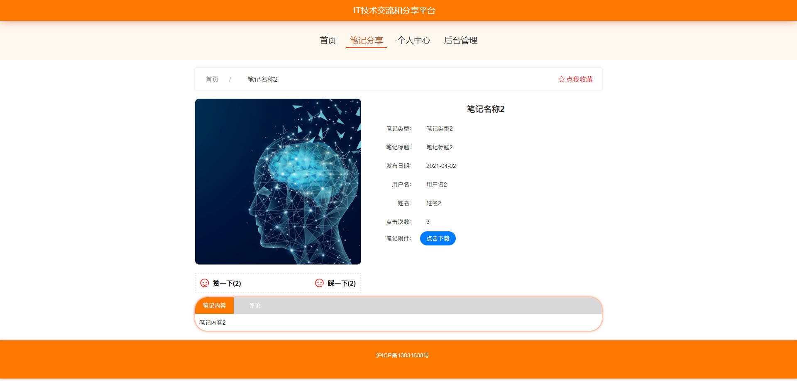
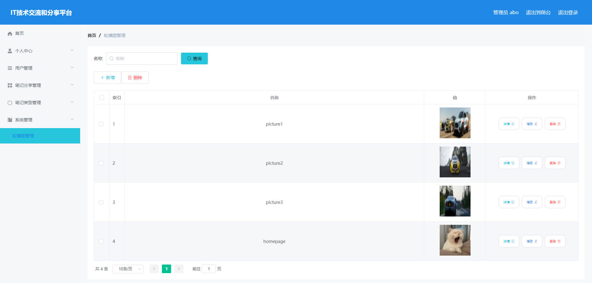

# 基于Springboot的IT技术交流和分享平台

## Springboot-0042


## 技术栈

Springboot mybatisplus vue mysql maven


## 数据库表(8张)


## 功能介绍

```properties
管理员登录后可对系统进行全面管理，管理员主要实现的功能模块包括个人中心、用户管理、笔记分享管理、笔记类型管理以及系统管理五大部分，


用户进入本系统可查看系统信息，包括首页、笔记分享，注册登录后主要功能模块包括个人中心、笔记分享管理、笔记类型管理以及我的收藏管理，
```


## 图片

### 前台




### 后台





## 访问路径

### 前台

```properties
http://localhost:8080/springboot1o52x/front/pages/login/login.html

账号 1
密码 1
```

### 后台

```properties
http://localhost:8080/springboot1o52x/admin/dist/index.html#/login

账号 abo
密码 abo
```


## 功能图


## 文档目录


## 打赏或交流


